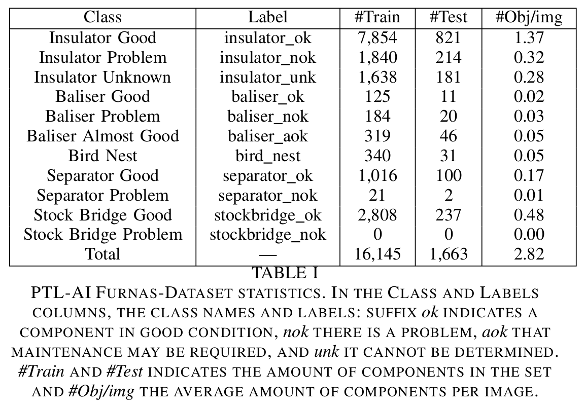

# PTL-AI Furnas Dataset: A Public Dataset for Fault Detection in Power Transmission Lines Using Aerial Images

This repo stores the PTL-AI Furnas Dataset from the paper: PTL-AI Furnas Dataset: A Public Dataset for Fault Detection in Power Transmission Lines Using Aerial Images.

Download the dataset here.

This paper has been accepted for presentation at SIBGRAPI 2022.

## Abstract
We present a new images dataset called PTL-AI Furnas Dataset as a new benchmark for fault detection in power
transmission lines. This dataset is composed of five components: baliser, bird nest, insulator, spacer and stockbridge, which have
different states. The images were extracted from real process of maintenance of Furnas power transmission lines. Furnas is
a company that generates or transmits electricity to 51% of households in Brazil and more than 40% of the nation’s electricity passes through their grid enabling generating the dataset in different backgrounds and climatic conditions. We performed experiments using data augmentation techniques to train Faster R-CNN, Single-Shot Detects (SSD) and YoloV5 models, with distinguished set of parameters. The benchmark result was obtained using the metrics of Mean Average Precision (mAP)
and the Mean Average Recall (mAR) with values mAP=91.9% and mAR=89.7%.

## Datasets Statistics

 

## Dataset Samples

## Annotated Samples

